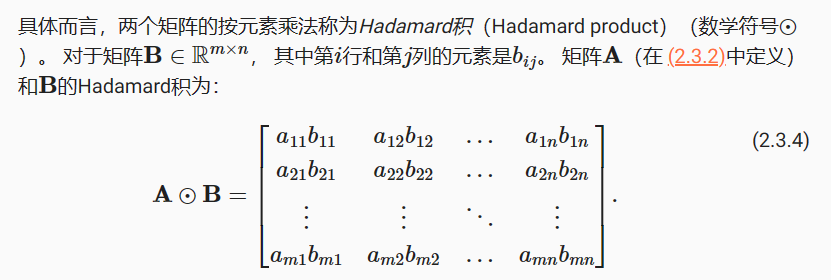
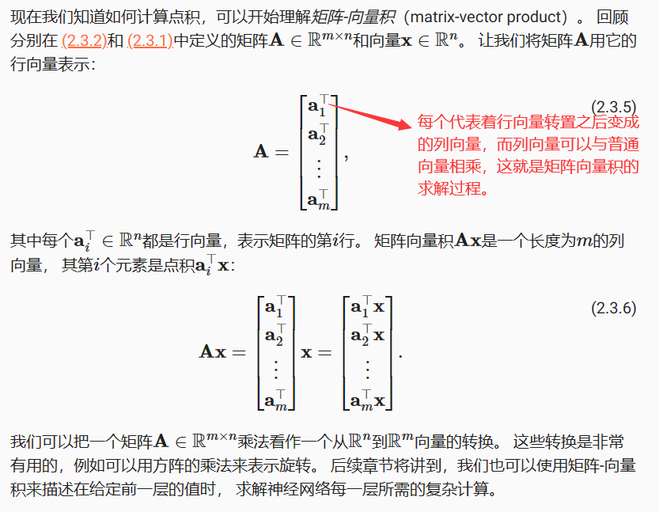
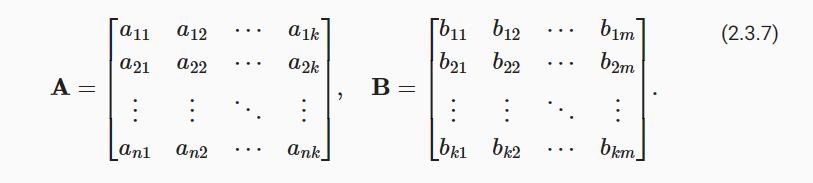
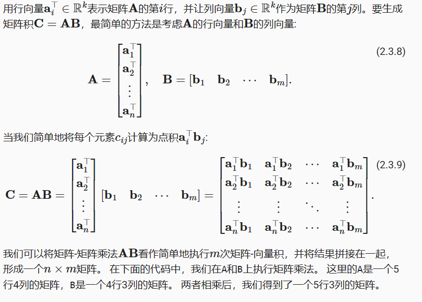
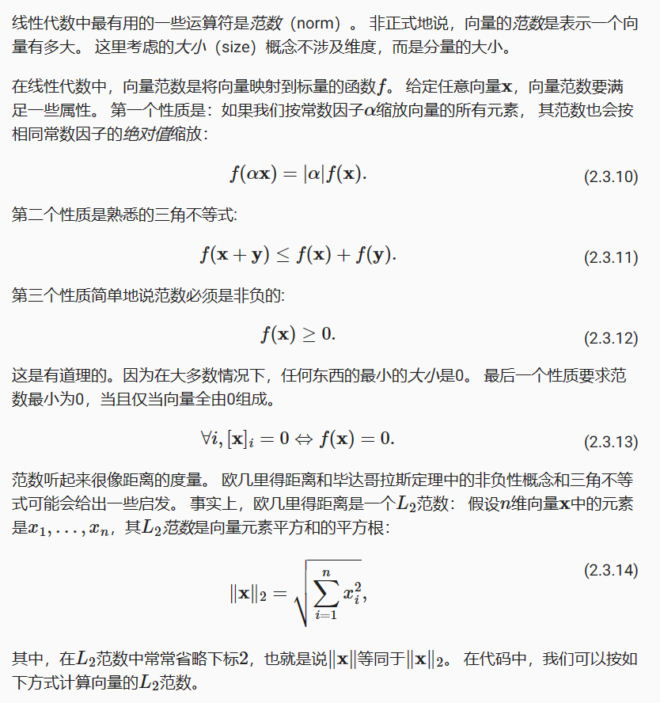
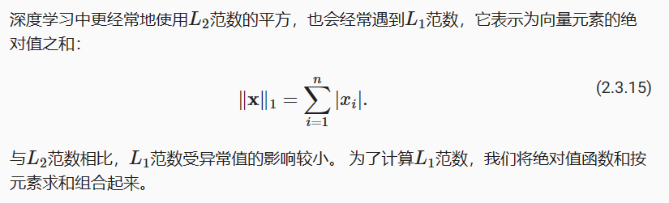
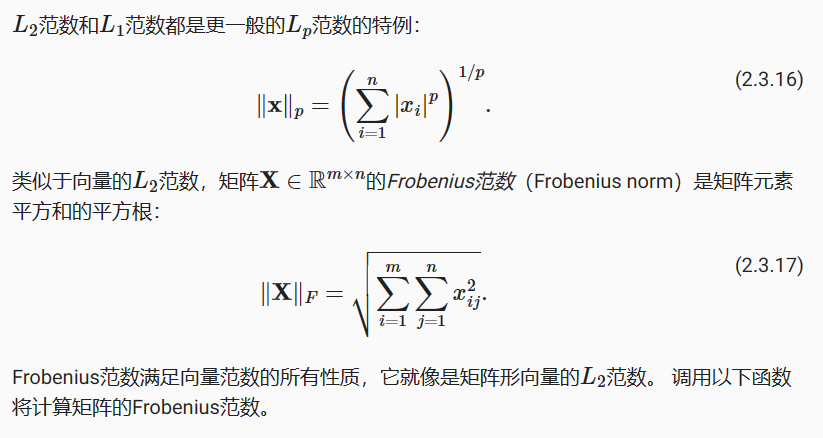

 # 张量算法的基本性质

标量、向量、矩阵和任意数量轴的张量（本小节中的“张量”指代数对象）有一些实用的属性。 例如，从按元素操作的定义中可以注意到，任何按元素的一元运算都不会改变其操作数的形状。 同样，给定具有相同形状的任意两个张量，任何按元素二元运算的结果都将是相同形状的张量。 例如，将两个相同形状的矩阵相加，会在这两个矩阵上执行元素加法


```python
import torch
A = torch.arange(20, dtype=torch.float32).reshape(5, 4)
B = A.clone()  # 通过分配新内存，将A的一个副本分配给B
A, A + B
```


    (tensor([[ 0.,  1.,  2.,  3.],
             [ 4.,  5.,  6.,  7.],
             [ 8.,  9., 10., 11.],
             [12., 13., 14., 15.],
             [16., 17., 18., 19.]]),
     tensor([[ 0.,  2.,  4.,  6.],
             [ 8., 10., 12., 14.],
             [16., 18., 20., 22.],
             [24., 26., 28., 30.],
             [32., 34., 36., 38.]]))





```python
A * B
```


    tensor([[  0.,   1.,   4.,   9.],
            [ 16.,  25.,  36.,  49.],
            [ 64.,  81., 100., 121.],
            [144., 169., 196., 225.],
            [256., 289., 324., 361.]])


将张量乘以或加上一个标量不会改变张量的形状，其中张量的每个元素都将与标量相加或相乘。


```python
a = 2
X = torch.arange(24).reshape(2, 3, 4)
a + X, (a * X).shape
```


    (tensor([[[ 2,  3,  4,  5],
              [ 6,  7,  8,  9],
              [10, 11, 12, 13]],
     
             [[14, 15, 16, 17],
              [18, 19, 20, 21],
              [22, 23, 24, 25]]]),
     torch.Size([2, 3, 4]))


# 降维¶

我们可以对任意张量进行的一个有用的操作是计算其元素的和。 数学表示法使用$\sum$符号表示求和。 为了表示长度为$d$的向量中元素的总和，可以记为$\sum_{i=1}^dx_i$。 在代码中可以调用计算求和的函数:


```python
x = torch.arange(4, dtype=torch.float32)
x, x.sum()
```


    (tensor([0., 1., 2., 3.]), tensor(6.))


我们可以表示任意形状张量的元素和。 例如，矩阵**A**中元素的和可以记为$\sum_{i=1}^m\sum_{j=1}^na_{ij}$。


```python
A.shape, A.sum()
```


    (torch.Size([5, 4]), tensor(190.))


默认情况下，调用求和函数会沿所有的轴降低张量的维度，使它变为一个标量。 我们还可以指定张量沿哪一个轴来通过求和降低维度。 以矩阵为例，为了通过求和所有行的元素来降维（轴0），可以在调用函数时指定axis=0。 由于输入矩阵沿0轴降维以生成输出向量，因此输入轴0的维数在输出形状中消失。


```python
A_sum_axis0 = A.sum(axis=0)
A_sum_axis0, A_sum_axis0.shape
```


    (tensor([40., 45., 50., 55.]), torch.Size([4]))


指定axis=1将通过汇总所有列的元素降维（轴1）。因此，输入轴1的维数在输出形状中消失。


```python
A_sum_axis1 = A.sum(axis=1)
A_sum_axis1, A_sum_axis1.shape
```


    (tensor([ 6., 22., 38., 54., 70.]), torch.Size([5]))


沿着行和列对矩阵求和，等价于对矩阵的所有元素进行求和。


```python
A.sum(axis=[0, 1])  # 结果和A.sum()相同
```


    tensor(190.)


一个与求和相关的量是平均值（mean或average）。 我们通过将总和除以元素总数来计算平均值。 在代码中，我们可以调用函数来计算任意形状张量的平均值。


```python
A.mean(), A.sum() / A.numel()
```


    (tensor(9.5000), tensor(9.5000))


同样，计算平均值的函数也可以沿指定轴降低张量的维度。


```python
A.mean(axis=0), A.sum(axis=0) / A.shape[0]
```


    (tensor([ 8.,  9., 10., 11.]), tensor([ 8.,  9., 10., 11.]))


# 非降维求和

但是，有时在调用函数来计算总和或均值时保持轴数不变会很有用。


```python
sum_A = A.sum(axis=1, keepdims=True)
sum_A
```


    tensor([[ 6.],
            [22.],
            [38.],
            [54.],
            [70.]])


例如，由于sum_A在对每行进行求和后仍保持两个轴，我们可以通过广播将A除以sum_A。


```python
A / sum_A
```


    tensor([[0.0000, 0.1667, 0.3333, 0.5000],
            [0.1818, 0.2273, 0.2727, 0.3182],
            [0.2105, 0.2368, 0.2632, 0.2895],
            [0.2222, 0.2407, 0.2593, 0.2778],
            [0.2286, 0.2429, 0.2571, 0.2714]])


如果我们想沿某个轴计算A元素的累积总和， 比如axis=0（按行计算），可以调用cumsum函数。 此函数不会沿任何轴降低输入张量的维度。


```python
A.cumsum(axis=0)
```


    tensor([[ 0.,  1.,  2.,  3.],
            [ 4.,  6.,  8., 10.],
            [12., 15., 18., 21.],
            [24., 28., 32., 36.],
            [40., 45., 50., 55.]])


# 点积（Dot Product）
我们已经学习了按元素操作、求和及平均值。 另一个最基本的操作之一是点积。 给定两个向量$x,y\in R^d$ ， 它们的点积（dot product）$x^Ty$（或$<x, y>$） 是相同位置的按元素乘积的和：$x^Ty =\sum_{i=1}^dx_iy_i$。


```python
y = torch.ones(4, dtype = torch.float32)
x, y, torch.dot(x, y)
```


    (tensor([0., 1., 2., 3.]), tensor([1., 1., 1., 1.]), tensor(6.))


注意，我们可以通过执行按元素乘法，然后进行求和来表示两个向量的点积：


```python
torch.sum(x * y)
```


    tensor(6.)


点积在很多场合都很有用。 例如，给定一组由向量$x\in R^d$表示的值， 和一组由
$w\in R^d$表示的权重。 $x$中的值根据权重$w$的加权和， 可以表示为点积$x^Tw$
。 当权重为非负数且和为1（即$\sum_{i=1}^dw_i = 1$）时， 点积表示加权平均（weighted average）。 将两个向量规范化得到单位长度后，点积表示它们夹角的余弦。 本节后面的内容将正式介绍长度（length）的概念。

# 矩阵-向量积



在代码中使用张量表示矩阵-向量积，我们使用mv函数。 当我们为矩阵A和向量x调用torch.mv(A, x)时，会执行矩阵-向量积。 注意，A的列维数（沿轴1的长度）必须与x的维数（其长度）相同。


```python
A.shape, x.shape, torch.mv(A, x)
```


    (torch.Size([5, 4]), torch.Size([4]), tensor([ 14.,  38.,  62.,  86., 110.]))


# 矩阵-矩阵乘法
在掌握点积和矩阵-向量积的知识后， 那么矩阵-矩阵乘法（matrix-matrix multiplication）应该很简单。

假设有两个矩阵$A \in R^{n*k}$和$B \in R^{k*m}$：




```python
B = torch.ones(4, 3)
torch.mm(A, B)
```


    tensor([[ 6.,  6.,  6.],
            [22., 22., 22.],
            [38., 38., 38.],
            [54., 54., 54.],
            [70., 70., 70.]])


# 范数（在我所学的知识里类似于各种距离，例如欧氏距离，马式距离等）
范数这个术语的起源可以追溯到拉丁语单词“norma”，意为“规则”或“标准”。在数学中，范数提供了一种度量和比较向量大小的方法，因此它就像是向量空间中的“标准”或“规则”。

在不同的数学和工程领域，范数被用于不同的目的。例如，在数值分析中，范数用于确定算法的误差；在优化问题中，范数用于定义目标函数的“成本”或“损失”；在机器学习中，范数可以用于正则化，以防止模型过拟合。

因此，"范数"这个名称恰当地反映了它在数学中的作用，即作为一种度量和规范向量大小的工具。



```python
u = torch.tensor([3.0, -4.0])
torch.norm(u)
```


    tensor(5.)





```python
torch.abs(u).sum()
```


    tensor(7.)





```python
torch.norm(torch.ones((4, 9)))
```


    tensor(6.)


# 范数和目标
在深度学习中，我们经常试图解决优化问题： 最大化分配给观测数据的概率; 最小化预测和真实观测之间的距离。 用向量表示物品（如单词、产品或新闻文章），以便最小化相似项目之间的距离，最大化不同项目之间的距离。 目标，或许是深度学习算法最重要的组成部分（除了数据），通常被表达为范数。
